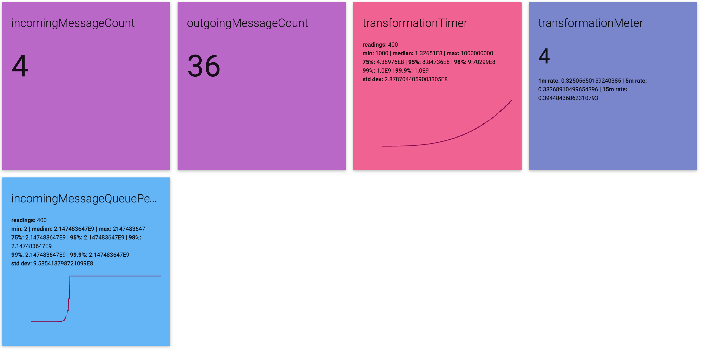

# play-dropwizard-metrics-dash
A Play Framework controller that renders a Dropwizard Metrics registry as a view.

Currently renders:
- Counter
- Timer
- Meter
- Histogram



### Dependencies
- Play 2.5+
- Dropwizard Metrics 3.1.2
- MaterializeCSS (0.97.7), jQuery (3.1.1), d3.js (v3), nv.d3 (1.8.1)

### Usage
Just put the controller and view in the appropriate Play directories and add something like below to your `routes` file:
```
GET    /metrics    controllers.MetricsController.metrics()
```
